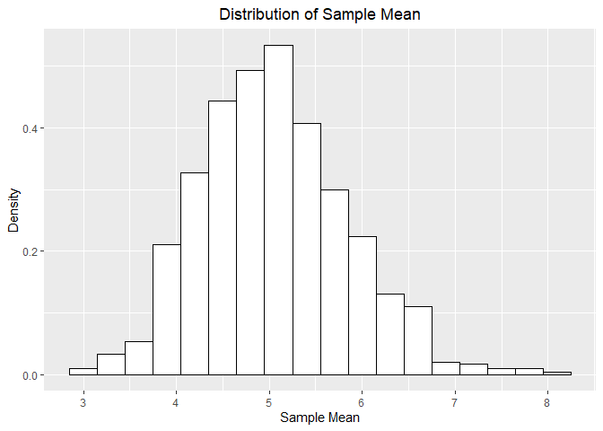
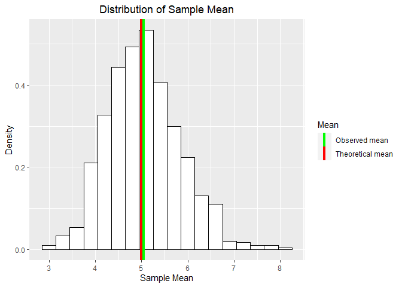
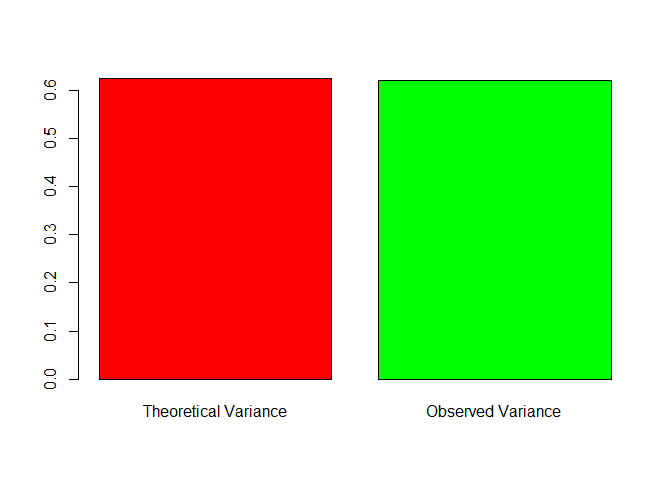
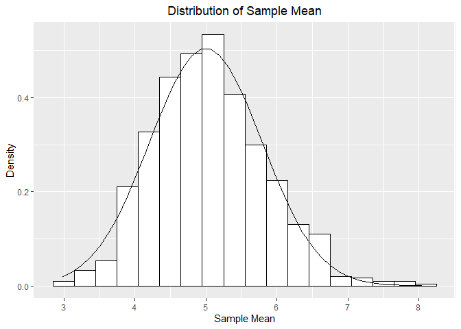

# Overview  
With this report we explore the relationship between the sample mean and the population mean from exponential distribution. Parameters and statistics of interest are the mean, the variance and, in a broader sense, the shape of the distribution. We run 1000 simulations of 40 observations each time. Also, We’re going to analyze the ToothGrowth data in the R datasets package.  

# Part 1  

## Simulations
We create a vector of size 1000 and fill it with the sample means of 1000 samples, each of which has size 40 observations. The distribution from which we draw the samples is exponential with rate parameter L = 0.2.


```r
mns <- apply(matrix(rexp(40000, 0.2), 1000), 1, mean)
mns <- data.frame(mns)
## histogram of the distribution
library(ggplot2)
g <- ggplot(mns, aes(x = mns))
g <- g + geom_histogram(aes(y = ..density..), color = "black", fill = "white", binwidth = 0.3) + 
  labs(x = "Sample Mean", y = "Density") + labs(title = "Distribution of Sample Mean") + 
  theme(plot.title = element_text(hjust = 0.5))
print(g)
```

<!-- -->

# Calculating the Constants


```r
obs_mean <- mean(mns[, 1]) ## observed mean
theo_mean <- 1/0.2         ## theoretical mean
Obs_var <- var(mns[, 1])   ## observed variance
theo_var <- 1/(0.2*0.2*40) ## theoretical variance
```

## Sample Mean Vs Theoretical Mean


```r
colors <- c("Theoretical mean" = "red", "Observed mean" = "green")
g <- ggplot(mns, aes(x = mns))
g <- g + geom_histogram(aes(y = ..density..), color = "black", fill = "white", binwidth = 0.3) + 
  geom_vline(aes(xintercept = theo_mean, color = "Theoretical mean"), size = 1.5) + 
  geom_vline(aes(xintercept = obs_mean, color = "Observed mean"), size = 1.5) + 
  scale_color_manual(values = colors) + labs(x = "Sample Mean", y = "Density") + labs(title = "Distribution of Sample Mean") + 
  theme(plot.title = element_text(hjust = 0.5)) + labs(colour = "Mean")
print(g)
```

<!-- -->

```r
print(paste("The Sample Mean is ", obs_mean, sep = " "))
```

```
## [1] "The Sample Mean is  5.04933620131591"
```

```r
print(paste("The Theoretical Mean is ", theo_mean, sep = " "))
```

```
## [1] "The Theoretical Mean is  5"
```

It can be seen that both Sample Mean and Theoretical Mean are approximately equal.  

## Sample Variance Vs Theoretical Variance  


```r
barplot(c(theo_var, Obs_var), col = c("red", "green"), names.arg = c("Theoretical Variance", "Observed Variance"))
```

<!-- -->

Just like with the expected values of the population and the sampling distributions, there is theoretically known link between the variances. The variance of the sample mean is equal to the population variance divided by the sample size. In mathematical notation, V(Xbar) = V(x)/n. The bigger the sample size, the smaller the uncertainty in the sample.  

## Distribution  
In order to help you see that the sampling distribution of the sample mean is approximately normal - even when the underlying distribution is exponential (non-normal), we will overlay the histogram with a theoretical normal curve.


```r
x <- seq(min(mns), max(mns), length.out = 40)
y <- dnorm(x, mean = theo_mean, sd = sqrt(theo_var))
d <- data.frame(x = x, y = y)
g <- ggplot(mns, aes(x = mns))
g <- g + geom_histogram(aes(y = ..density..), color = "black", fill = "white", binwidth = 0.3) + 
  geom_line(data = d, aes(x = x, y = y)) + 
  labs(x = "Sample Mean", y = "Density") + labs(title = "Distribution of Sample Mean") + 
  theme(plot.title = element_text(hjust = 0.5))
g
```

<!-- -->

The Central Limit Theorem proves that when we have a large size of the sample, if we sample a lot of samples - from whatever distribution - and construct their histogram, we will observe approximately normal distribution. The larger the sample, the closer to the normal look. Some textbook authors say that a sample size of just over 30 is enough to achieve this nice result. Here we had samples of 40. No less important was that we sampled a lot of samples - 1000. This aspect of the simulation also adds to the closeness to normality of the empirical distribution.  

# Part 2  
Load the ToothGrowth data and perform some basic exploratory data analyses Provide a basic summary of the data.


```r
library(datasets)
data(ToothGrowth)
```

## Data Exploration  

```r
head(ToothGrowth)
```

```
##    len supp dose
## 1  4.2   VC  0.5
## 2 11.5   VC  0.5
## 3  7.3   VC  0.5
## 4  5.8   VC  0.5
## 5  6.4   VC  0.5
## 6 10.0   VC  0.5
```

```r
summary(ToothGrowth)
```

```
##       len        supp         dose      
##  Min.   : 4.20   OJ:30   Min.   :0.500  
##  1st Qu.:13.07   VC:30   1st Qu.:0.500  
##  Median :19.25           Median :1.000  
##  Mean   :18.81           Mean   :1.167  
##  3rd Qu.:25.27           3rd Qu.:2.000  
##  Max.   :33.90           Max.   :2.000
```


## Hypothesis Testing  

Assumptions
1. The variables must be independent and identically distributed (i.i.d.).

2. Variances of tooth growth are different when using different supplement and dosage.

3. Tooth growth follows a normal distribution.

Hypothesis for the supplement OJ vs VC
Let our null hypothesis to be there is no difference in tooth growth when using the supplement OJ and VC.

lenOJ=lenVC

Let our alternate hypothesis to be there are more tooth growth when using supplement OJ than VC.

lenOJ>lenVC

Then, we obtain the tooth growth by supplement type from the data


```r
OJ = ToothGrowth$len[ToothGrowth$supp == 'OJ']
VC = ToothGrowth$len[ToothGrowth$supp == 'VC']
```

We will perform a t-test following the indications of the work to be evaluated.  

One-tailed independent t-test with unequal variance.  


```r
t.test(OJ, VC, alternative = "greater", paired = FALSE, var.equal = FALSE, conf.level = 0.95)
```

```
## 
## 	Welch Two Sample t-test
## 
## data:  OJ and VC
## t = 1.9153, df = 55.309, p-value = 0.03032
## alternative hypothesis: true difference in means is greater than 0
## 95 percent confidence interval:
##  0.4682687       Inf
## sample estimates:
## mean of x mean of y 
##  20.66333  16.96333
```

As the p-value (0.03032) is lower than 0.05 (the default value for the tolerance of the error alpha), then, we reject the null hypothesis. That can be interpreted as there is aproximately 3% of chance of obtain an extreme value for the difference in mean of tooth growth.  

Finally, based on this low p-value, we can conclude that it is very likely that supplement OJ, the greater the effect on tooth growth than supplement VC.  

## Hypothesis for the dossage  

The null hypothesis is that there is no difference in tooth growth between dosage. Our alternate hypothesis is that there are more tooth growth when the dosage increases.  

Extract the tooth growth by dosage.  


```r
doseHalf = ToothGrowth$len[ToothGrowth$dose == 0.5]
doseOne = ToothGrowth$len[ToothGrowth$dose == 1]
doseTwo = ToothGrowth$len[ToothGrowth$dose == 2]
```

One-tailed independent t-test with unequal variance.  

```r
t.test(doseHalf, doseOne, alternative = "less", paired = FALSE, var.equal = FALSE, conf.level = 0.95)
```

```
## 
## 	Welch Two Sample t-test
## 
## data:  doseHalf and doseOne
## t = -6.4766, df = 37.986, p-value = 6.342e-08
## alternative hypothesis: true difference in means is less than 0
## 95 percent confidence interval:
##       -Inf -6.753323
## sample estimates:
## mean of x mean of y 
##    10.605    19.735
```

As the p-value (6.342e-08) is lower than 0.05 (the default value for the tolerance of the error alpha), then, we reject the null hypothesis. That can be interpreted as there is almost null chances of obtain an extreme value for the difference in mean of those dossages (doseHalf < doseOne) on the tooth growth.  


```r
t.test(doseOne, doseTwo, alternative = "less", paired = FALSE, var.equal = FALSE, conf.level = 0.95)
```

```
## 
## 	Welch Two Sample t-test
## 
## data:  doseOne and doseTwo
## t = -4.9005, df = 37.101, p-value = 9.532e-06
## alternative hypothesis: true difference in means is less than 0
## 95 percent confidence interval:
##      -Inf -4.17387
## sample estimates:
## mean of x mean of y 
##    19.735    26.100
```

The conclusion is similar than the previous, the p-value is 9.532e-06, close to 0. Then we reject the null hypothesis. That can be interpreted as there is almost null chances of obtain an extreme value for the difference in mean of those dossages (doseOne < doseTwo) on the tooth growth. The value is extreme (that’s what we reject the null hypothesis).  

Finally, based on these low p-values, we can conclude that it is very likely that dossage has effect, and a higher dossage higher tooth growth.
